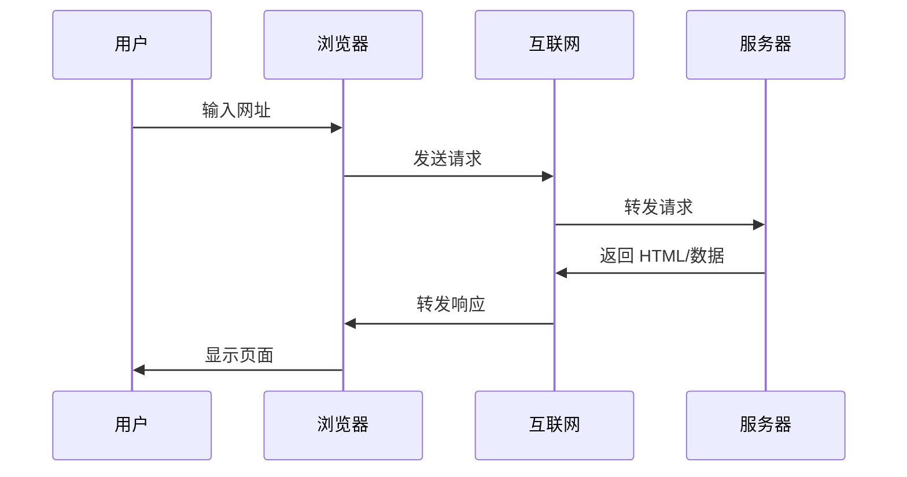
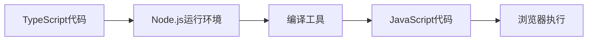
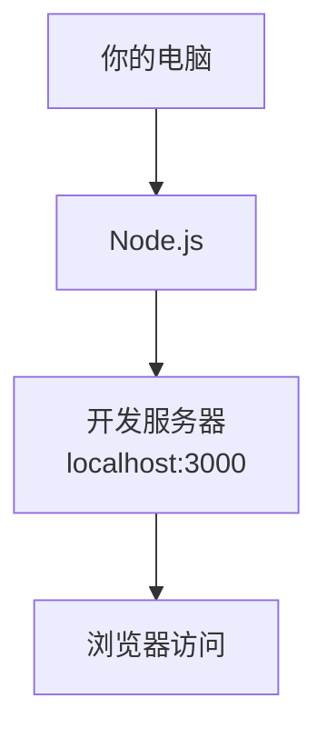
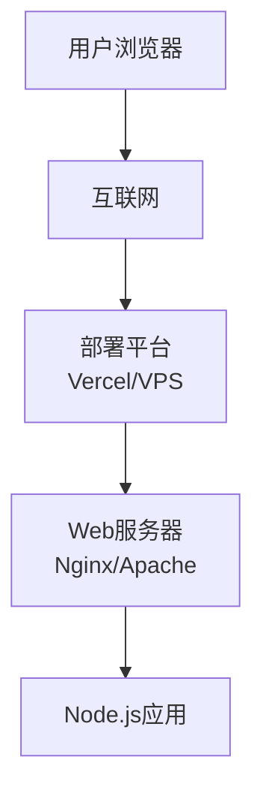

# 1.3 浏览器与服务器基础

> **阅读完本节后，你将会收获：**
> - 理解浏览器和服务器的基本职责及它们如何协作
> - 掌握开发环境（localhost）与生产环境的区别
> - 了解为什么 TypeScript 需要编译以及 Node.js 在开发中的作用
> - 学会区分服务端代码与客户端代码及各自的适用场景
> - 知道如何启动本地开发服务器并理解其工作原理

> 序言中提到的"浏览器看不懂 TypeScript"，是因为浏览器和服务器的职责不同。

## 前置知识

::: tip 什么是 浏览器

浏览器（Chrome、Firefox、Safari）是运行在用户电脑上的软件，负责显示网页。它只能理解 HTML、CSS、JavaScript。
:::

::: tip 什么是 服务器

服务器是远程的计算机，运行着 Web 服务器软件（如 Nginx、Apache），响应浏览器的请求，返回网页或数据。
:::

::: tip 什么是 客户端与服务端

**客户端（Client）**：用户使用的设备（浏览器、手机 App）。

**服务端（Server）**：提供服务的一方（服务器、API）。
:::

## 核心概念

Web 应用的基本工作流程：

### 浏览器 vs 服务器

::: tip 🖥️ 浏览器（客户端）

**负责**

- 渲染页面显示
- 执行交互逻辑
- 向服务器请求数据
- 存储 Cookie、LocalStorage

**能运行**

- ✅ HTML、CSS、JavaScript
- ❌ TypeScript、后端语言

:::

::: tip 🗄️ 服务器（服务端）

**负责**

- 处理业务请求
- 计算与验证数据
- 查询数据库
- 返回 HTML 或 JSON

**能运行**

- ✅ Node.js、Python、Go
- ❌ 浏览器 API

:::

### 为什么需要 Node.js

TypeScript 代码需要编译才能在浏览器运行，这个编译过程需要一个运行环境：

::: tip 什么时候需要 Node.js？

只要涉及以下情况，就必须安装 Node.js：

- **TypeScript 项目**：需要编译 TS 为 JS
- **使用 npm 包**：需要安装和管理依赖
- **运行构建工具**：Vite、Webpack、Next.js 等
- **本地开发**：启动开发服务器预览效果

简单说：现代前端开发几乎都需要 Node.js。

:::

**Node.js 的作用**：
- 在你的电脑上运行构建工具
- 编译 TypeScript
- 打包代码
- 启动开发服务器

## 开发环境 vs 生产环境

::: tip 💻 开发环境（Localhost）

**特点**

- 运行在你的电脑上
- 地址是 `localhost:3000`
- 支持热重载（修改代码自动刷新）
- 显示详细错误信息

:::

::: tip 🌐 生产环境（公网服务器）

**特点**

- 运行在远程服务器
- 地址是公网域名（如 `https://example.com`）
- 优化后的代码（压缩、混淆）
- 只显示必要的错误信息

:::

## 补充说明

### 运行环境差异

服务器可以访问文件系统、数据库、环境变量。浏览器只能访问页面内容和用户设备（有限权限）。

## 相关内容

- 详见：[1.1 代码格式演变]
- 详见：[1.8 Localhost与端口]   
- 详见：[第6章 环境变量与安全机制]  
- 前置：[1.2 技术栈概念]
- 后续：[1.5 Node.js环境与包管理]
