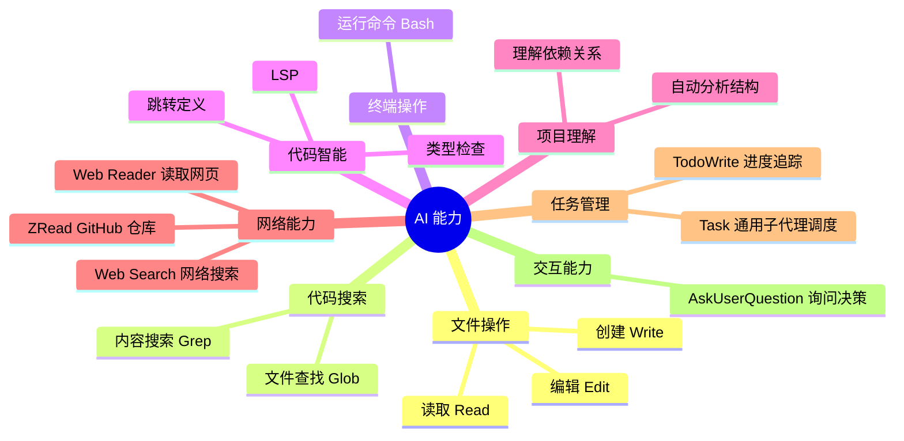
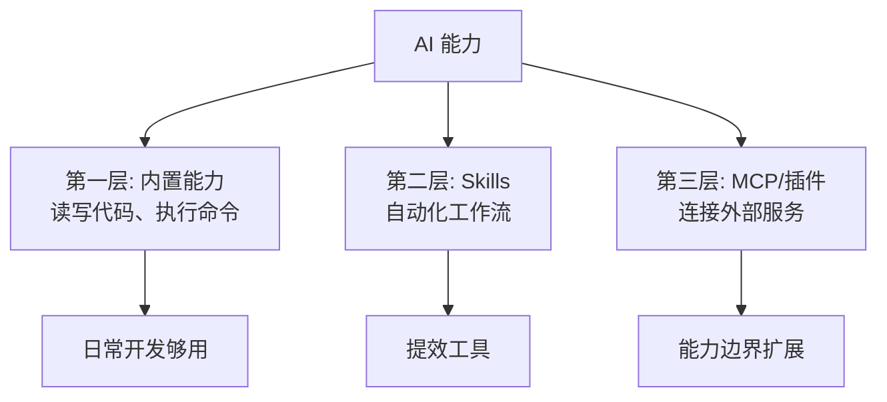

# 2.3 MCP、插件与 Skills 🟡

> **阅读完本节后，你将会收获：**
> - 理解 MCP、插件、Skills 三种扩展方式的区别和使用场景，学会按需选择
> - 掌握插件商店安装方法，了解常用插件（typescript-lsp、frontend-design、feature-dev 等）
> - 学会 MCP 服务器配置和身份验证，能够连接数据库、API、GitHub 等外部服务
> - 理解 Skills 的工作原理和创作要点，能够创建可复用的技能包
> - 建立安全意识，学会为 MCP 和插件配置合理的权限限制

> 序言中提到的"Skills 定义专属指令"和"MCP 让 AI 连接外部工具"。大部分情况下，你只需要**安装和使用现有的 MCP 服务器**，不需要自己开发。

::: tip 新手路径建议

**如果你是新手**，建议按以下顺序学习：

1. 先了解内置能力（本章下一节）→ 大部分场景已经够用
2. 需要外部服务时，优先安装插件（比 MCP 配置更简单）
3. 熟悉后再根据需要配置 MCP
4. 最后考虑创建自己的 Skills（进阶内容）

**核心原则**：能用内置的就不用扩展，能用插件的就不手动配置。

:::

**资源导航**：
- 插件市场：[claude-plugins.dev](https://claude-plugins.dev/) - 浏览和搜索插件
- Skills 市场：[skillsmp.com](https://skillsmp.com/zh) - 2300+ Skills 搜索目录
- Agent Skills：[agentskills.io](https://agentskills.io/home) - Agent Skills 规范和市场
- 官方插件库：[GitHub - anthropics/claude-code/plugins](https://github.com/anthropics/claude-code/tree/main/plugins)
- 官方 Skills 库：[GitHub - anthropics/skills](https://github.com/anthropics/skills)

## 前置知识

::: tip 什么是 MCP

**MCP** = 外部工具连接

MCP (Model Context Protocol) 让 AI 能连接外部服务（数据库、API、文件系统等）。MCP 可以独立配置，也可以打包在插件中。

:::

::: tip 什么是 插件

**插件** = 扩展容器（分发单位）

插件是功能包，可以包含 Skills、Commands、Agents、Hooks、MCP Servers。通过插件商店一键安装，比手动配置 MCP 更简单。

| 需求 | 推荐方式 |
|------|----------|
| 代码智能（LSP） | 安装插件 |
| 连接外部服务 | 配置 MCP 或安装包含 MCP 的插件 |
| 自动化工作流 | 创建或安装 Skills |
| 一键安装多个功能 | 安装插件 |

**核心原则**：能用插件的就不手动配置 MCP，能用内置的就不扩展。

:::

::: tip 什么是 Skills

**Skills** = AI 的可复用技能包

Skills 通过 `SKILL.md` 文件定义特定能力，Claude 根据请求内容自动判断是否使用。

**调用方式**：
- **Skills**：模型调用 —— AI 根据描述自动决定
- **斜杠命令**：用户调用 —— 用户显式输入触发

:::

### 你必须知道的 AI 能力范围

**AI 能做的**：

| AI 能做 | AI 不能做 |
|--------|----------|
| 读取你项目中的任何文件 | 访问你电脑上的任意路径 |
| 运行你允许的命令 | 执行需要图形界面的操作 |
| 理解代码结构和逻辑 | "记住"上次对话的内容 |
| 连接你配置的外部服务 | 绕过系统安全限制 |
| 自动选择合适的工具 | 猜测你心里想什么（所以请明确说） |

:::tip 关键认知
**你只需要告诉 AI 你想做什么，AI 会自动选择合适的方法。你不需要知道 AI 用的是 Read（读取文件）、Edit（编辑文件） 、Grep（搜索内容）、Glob（查找文件） 还是 Bash（运行命令），甚至是 Python（运行复制脚本）。**
:::
**你不需要记住工具细节**

| 不需要记住 | 原因 |
|-----------|------|
| 工具的名字（Read、Edit、Grep...） | AI 会自动选择 |
| 具体的配置语法 | 让 AI 参考官方文档帮你生成 |
| 所有可用的 MCP/插件服务器 | 按需搜索安装 |

**你只需要用自然语言清晰地描述你想做的事情。**

##  AI 有哪些能力

在配置 MCP 或 Skills 之前，记住：**AI 已经有很多内置能力**。

::: details 查看内置工具完整列表



### 按类型分类的工具表

**1. 文件操作工具** - 读写代码的基础

| 能力 | 使用工具 | 示例 |
|------|----------|------|
| 读取文件 | Read | "读取 package.json" |
| 编辑文件 | Edit | "把函数名改成 xxx" |
| 创建文件 | Write | "创建新组件" |

**2. 搜索工具** - 找到需要的东西

| 能力 | 使用工具 | 示例 |
|------|----------|------|
| 搜索代码内容 | Grep | "搜索所有 TODO" |
| 查找文件 | Glob | "找到所有 .ts 文件" |

**3. 终端工具** - 执行命令

| 能力 | 使用工具 | 示例 |
|------|----------|------|
| 运行命令 | Bash | "运行 pnpm test" |

**4. 代码智能** - 通过插件额外支持

| 能力 | 使用插件 | 示例 |
|------|----------|------|
| TypeScript/JavaScript 类型检查、跳转定义 | typescript-lsp | "这个函数在哪里定义的？" |
| Python 类型检查、代码补全 | pyright-lsp | "这个类的类型是什么？" |


LSP（语言服务器）能力**不是内置**，需要通过插件额外安装：

```bash
# 打开插件管理界面
/plugin

# 搜索 typescript-lsp 或 pyright-lsp 并安装
```

支持的语言包括：TypeScript、JavaScript、Python、Rust、Go、C/C++、C#、PHP、Java、Ruby、Swift 等。


**5. 项目理解** - 自动分析

| 能力 | 使用工具 | 示例 |
|------|----------|------|
| 分析结构、理解依赖 | 自动分析 | "分析项目结构" |

**6. 网络能力** - 需要配置 MCP/插件

| 能力 | 使用工具 | 需要配置 |
|------|----------|-------------|
| 读取网页内容 | Web Reader MCP | ✅ |
| 网络搜索 | Web Search MCP | ✅ |
| 读取 GitHub 仓库 | ZRead MCP | ✅ |


**AI 能读取的**：
- ✅ 公开的网页链接（通过 MCP/插件）
- ✅ GitHub 仓库文件（通过 ZRead MCP）
- ✅ 文档站点（通过 Web Reader MCP）

**AI 不能读取的**：
- ❌ 需要登录的页面
- ❌ 本地文件路径（非项目目录）
- ❌ 被防火墙阻挡的网站


**7. 任务管理** - AI 自动使用，你只需看到效果

| 能力 | 使用工具 | 你需要知道吗 |
|------|----------|-------------|
| 追踪多步骤任务进度 | TodoWrite | ❌ AI 自动用，你看到进度即可 |
| 调用通用子代理处理复杂任务 | Task | ❌ AI 自动调用，你不需要知道 |

**8. 交互能力** - AI 自动使用，你只需回答

| 能力 | 使用工具 | 你需要知道吗 |
|------|----------|-------------|
| 向你提问获取决策 | AskUserQuestion | ❌ AI 自动用，你只需回答 |

### 判断标准：内置够用还是需要扩展？

```bash
# ✅ 不需要扩展的场景（内置足够）
"读取文件并分析"      → 用 Read 工具
"运行命令并处理结果"   → 用 Bash 工具
"实现某个功能"        → 直接描述任务，AI 自动规划

# ❌ 需要扩展的场景
"查询 PostgreSQL 数据库"     → 需要 MCP/插件
"读取 Google Drive 文档"     → 需要 MCP/插件
"调用 Slack API 发送消息"    → 需要 MCP/插件
```

**何时使用扩展**：

| 需求 | 使用方式 |
|------|----------|
| ✅ 数据库查询 | MCP/插件 |
| ✅ 网络搜索 | MCP/插件 |
| ✅ 读取外部 API | MCP/插件 |
| ✅ 重复执行复杂流程 | Skills |
| ❌ 一次性任务 | 直接用自然语言 |

:::

## 插件：最简单的扩展方式

::: tip 插件 vs MCP

插件（Plugins）是通过插件商店安装的扩展，功能和 MCP 类似，但安装更简单：

| 特性 | MCP | 插件 |
|------|-----|------|
| **安装方式** | 配置文件 + CLI 命令 | 插件商店或命令一键安装 |
| **配置** | 手动编辑 JSON | 自动配置 |
| **来源** | 社区开源 | 官方 + 第三方 |
| **包含内容** | 仅 MCP 服务器 | 可包含命令、代理、Skills、Hooks、MCP |

**功能上两者是一样的**：都让 AI 能连接外部服务。选择哪种方式取决于你的工具支持。

:::

### 安装方式

**方式 1：通过插件商店（推荐）**

```bash
/plugin 
# 打开插件管理界面，搜索需要的插件，按空格选中，按 i 安装
```

**方式 2：通过命令安装**

```bash
# 示例
/plugin install frontend-design@anthropics
```

**如果找不到你需要的插件，可以考虑添加插件所在的市场**

```bash
# 添加市场
/plugin marketplace add your-org/claude-plugins

# 浏览可用插件
/plugin
```

### 常用插件推荐

::: tip 推荐插件（新手必读）

对于新手，推荐从这些插件开始：

**基础开发**：
- `typescript-lsp` - TypeScript/JavaScript 类型检查、代码补全、跳转定义
- `pyright-lsp` - Python 类型检查和代码智能
- `frontend-design` - 生成高质量前端界面

**工作流**：
- `feature-dev` - 完整的功能开发工作流
- `pr-review-toolkit` - PR 审查工具包
- `commit-commands` - Git 提交工作流

**安装方式**：
```bash
# 打开插件管理界面，搜索上述插件并安装
/plugin
```

:::


::: details 查看完整插件推荐列表

#### LSP 语言服务器（代码智能）

| 插件 | 功能 |
|------|------|
| **typescript-lsp** | TypeScript/JavaScript 类型检查、代码补全、跳转定义 |
| **pyright-lsp** | Python 类型检查和代码智能 |
| **rust-analyzer-lsp** | Rust 语言服务器，代码智能和分析 |
| **gopls-lsp** | Go 语言服务器，代码智能和重构 |
| **clangd-lsp** | C/C++ 语言服务器，代码智能 |
| **csharp-lsp** | C# 语言服务器，代码智能 |
| **php-lsp** | PHP 语言服务器（Intelephense），代码智能 |
| **swift-lsp** | Swift 语言服务器（SourceKit-LSP），代码智能 |
| **jdtls-lsp** | Java 语言服务器，代码智能 |
| **lua-lsp** | Lua 语言服务器，代码智能 |

#### 开发工作流

| 插件 | 功能 |
|------|------|
| **frontend-design** | 生成高质量前端界面，避免通用 AI 美学 |
| **feature-dev** | 完整的功能开发工作流（7 阶段：发现、探索、澄清、设计、实现、审查、总结） |
| **pr-review-toolkit** | PR 审查工具包，专注代码质量、测试、错误处理 |
| **commit-commands** | Git 工作流简化，提交、推送、创建 PR 一键完成 |
| **ralph-wiggum** | 迭代式 AI 开发循环技术 |

#### 代码质量与安全

| 插件 | 功能 |
|------|------|
| **code-review** | 自动代码审查，多专业代理并行分析，基于置信度评分过滤误报 |
| **security-guidance** | 安全提醒 Hook，警告命令注入、XSS、不安全代码模式 |
| **hookify** | 自动创建 Hooks，通过分析对话模式或明确指令防止不良行为 |

#### 开发工具包

| 插件 | 功能 |
|------|------|
| **agent-sdk-dev** | Agent SDK 开发工具包，创建和验证 Python/TypeScript Agent SDK 应用 |
| **plugin-dev** | 插件开发工具包，Hooks、MCP 集成、插件结构、市场发布指导 |

#### 输出风格

| 插件 | 功能 |
|------|------|
| **explanatory-output-style** | 解释性输出风格，详细解释 AI 的思考和决策过程 |
| **learning-output-style** | 学习导向输出，结合交互式学习和教育见解 |

#### 示例与模板

| 插件 | 功能 |
|------|------|
| **example-plugin** | 插件开发示例模板 |

**安装方式**：输入 `/plugin` 后搜索并安装所需插件。

:::


### 使用插件

安装后，插件会自动集成到 AI 的能力中，无需额外配置：

```bash
# 前端设计（安装 frontend-design 后）
"创建一个用户登录页面，要求现代设计风格"

# 功能开发（安装 feature-dev 后）
"使用 feature-dev 工作流开发用户评论功能"

# 代码审查（安装 pr-review-toolkit 后）
"用 PR 审查工具检查这段代码"
```
### 插件结构

::: details 插件目录结构

插件是一个包含以下组件的 npm 包：

```
my-plugin/
├── .claude-plugin/
│   ├── plugin.json          # 插件元数据
│   └── marketplace.json     # 市场清单（可选）
├── commands/                 # 自定义斜杠命令（可选）
│   └── hello.md
├── agents/                   # 自定义代理（可选）
│   └── helper.md
├── skills/                   # 代理技能（可选）
│   └── my-skill/
│       └── SKILL.md
├── hooks/                    # 事件处理程序（可选）
│   └── hooks.json
└── .mcp.json                # MCP 服务器配置（可选）
```

**组件说明**：
- **plugin.json**：插件元数据（名称、描述、版本、作者）
- **commands/**：自定义斜杠命令（Markdown 文件）
- **agents/**：子代理定义
- **skills/**：代理技能（SKILL.md 文件）
- **hooks/**：事件处理程序（hooks.json）
- **.mcp.json**：MCP 服务器配置

:::
### 插件管理

::: details 管理命令

```bash
# 查看已安装的插件
/plugin

# 启用已禁用的插件
/plugin enable plugin-name@marketplace-name

# 禁用而不卸载
/plugin disable plugin-name@marketplace-name

# 卸载插件
/plugin uninstall plugin-name@marketplace-name
```

:::

::: details 团队协作

在存储库级别配置插件以确保整个团队的工具一致。

**设置团队插件**：

1. 将市场和插件配置添加到您的存储库的 `.claude/settings.json`
2. 团队成员信任存储库文件夹
3. 为所有团队成员自动安装插件

**配置示例**（`.claude/settings.json`）：

```json
{
  "pluginMarketplaces": [
    {
      "source": "your-org/claude-plugins"
    }
  ],
  "plugins": [
    {
      "name": "formatter",
      "marketplace": "your-org"
    }
  ]
}
```

:::

## MCP：连接外部服务

::: warning 安装前必读

**关于兼容性**：MCP 在不同 CLI 工具间**不通用**，安装方式可能不同。

**关于安装方式**：
- **IDE 内**：通常有 MCP 市场，可直接安装
- **CLI 工具**：通过配置文件手动配置
- **一键配置工具**：如 GLM4.7 配置工具，会自动预装部分 MCP

**关于鉴权**：部分 MCP 需要 API Key 才能使用（如 OpenAI、Stripe、GitHub），配置时需要提供。

:::

::: tip GLM4.7 一键配置工具默认包含的 MCP

使用 GLM4.7 一键配置工具时，以下 MCP 会自动安装：

| MCP | 功能 |
|-----|------|
| **Vision MCP** | 图片分析（截图、设计图等） |
| **Web Search MCP** | 网络搜索，获取最新信息 |
| **Web Reader MCP** | 读取网页链接内容 |
| **ZRead MCP** | 读取 GitHub 仓库文件和目录 |

这些是开发中最常用的网络能力，开箱即用。

:::

### 热门 MCP 服务器

| 分类 | MCP | 功能 |
|------|-----|------|
| **开发调试** | [GitHub MCP](https://github.com/github/github-mcp-server) | 操作代码仓库、PR、Issue 和 CI 流程 |
| | [Chrome DevTools MCP](https://github.com/ChromeDevTools/chrome-devtools-mcp) | 操控浏览器进行页面调试、网络分析和自动化检查 |
| | [ShadCN MCP](https://www.shadcn.com.cn/docs/mcp) | 生成可直接使用的 React + Tailwind UI 组件 |
| | [Semgrep MCP](https://semgrep.dev/docs/mcp) | 代码静态安全扫描和规则检测 |
| **数据库** | [PostgreSQL MCP](https://github.com/crystaldba/postgres-mcp) | 可配置的读写访问和性能分析 |
| | [Neon MCP](https://neon.com/docs/ai/neon-mcp-server) | 按需创建和管理 Serverless PostgreSQL 数据库 |
| | [Supabase MCP](https://supabase.com/docs/guides/getting-started/mcp) | 认证、数据库、存储、实时能力的一体化后端 |
| **部署托管** | [Vercel MCP](https://vercel.com/docs/mcp) | 自动部署前端应用并生成预览环境 |
| | [Cloudflare MCP](https://github.com/cloudflare/mcp-server-cloudflare) | 管理边缘计算资源（Workers、KV、R2） |
| **设计与媒体** | [Figma MCP](https://developers.figma.com/docs/figma-mcp-server/remote-server-installation/) | 读取和修改 Figma 设计稿，实现设计到代码自动化 |
| | [Replicate MCP](https://mcp.replicate.com/) | 调用图片生成接口，生成配图 |
| **文档与上下文** | [Context7 MCP](https://context7.com/docs/overview) | 将官方实时最新文档转化为可靠上下文 |
| | [Ref MCP](https://ref.tools/mcp) | 类似 Context7，减少 AI 幻觉 |
| **支付** | [Stripe MCP](https://docs.stripe.com/mcp) | 自动化创建支付、订阅及 Webhook |

**注意**：部分 MCP 需要 API Key 才能使用。更多 MCP 服务器请访问 [MCP 合集](https://github.com/modelcontextprotocol/servers)。

:::
由于 MCP 服务器更新频繁，建议点击上方链接或搜索官网查询最新使用方式。
:::

### 使用 MCP

```bash
# 查询数据库
"查询 PostgreSQL：获取最近 7 天的注册用户数"

# 读取 GitHub
"查看仓库状态：最近 5 个 PR"

# 网络搜索
"搜索：Next.js 16 的新特性"

# 读取文件
"读取 /path/to/file.md 并总结内容"
```

### 其他安装方式

::: details 从 JSON 配置添加

如果您有 MCP 服务器的 JSON 配置，可以直接添加：

```bash
# 基本语法
claude mcp add-json <name> '<json>'

# 示例：添加带有 JSON 配置的 HTTP 服务器
claude mcp add-json weather-api '{"type":"http","url":"https://api.weather.com/mcp","headers":{"Authorization":"Bearer token"}}'

# 示例：添加带有 JSON 配置的 stdio 服务器
claude mcp add-json local-weather '{"type":"stdio","command":"/path/to/weather-cli","args":["--api-key","abc123"],"env":{"CACHE_DIR":"/tmp"}}'
```

:::


::: details 查看安装与配置

### 三种安装方式


#### 选项 1：添加远程 HTTP 服务器（推荐）

HTTP 服务器是连接到远程 MCP 服务器的推荐选项。这是云服务最广泛支持的传输方式。

```bash
# 基本语法
claude mcp add --transport http <name> <url>

# 真实示例：连接到 Notion
claude mcp add --transport http notion https://mcp.notion.com/mcp

# 带有 Bearer 令牌的示例
claude mcp add --transport http secure-api https://api.example.com/mcp \
  --header "Authorization: Bearer your-token"
```


#### 选项 2：添加本地 stdio 服务器

Stdio 服务器作为本地进程在您的计算机上运行。它们非常适合需要直接系统访问或自定义脚本的工具。

```bash
# 基本语法
claude mcp add --transport stdio <name> <command> [args...]

# 真实示例：添加 Airtable 服务器
claude mcp add --transport stdio airtable --env AIRTABLE_API_KEY=YOUR_KEY \
  -- npx -y airtable-mcp-server
```


##### tip 理解 "--" 参数

`--`（双破折号）将 CLI 工具的标志与传递给 MCP 服务器的命令和参数分开。`--` 之前的所有内容都是工具的选项（如 `--env`、`--scope`），`--` 之后的所有内容都是运行 MCP 服务器的实际命令。

例如：
- `claude mcp add --transport stdio myserver -- npx server` → 运行 `npx server`
- `claude mcp add --transport stdio myserver --env KEY=value -- python server.py --port 8080` → 运行 `python server.py --port 8080`，环境中设置 `KEY=value`

这可以防止工具的标志与服务器标志之间的冲突。


##### Windows 用户

在本机 Windows（不是 WSL）上，使用 `npx` 的本地 MCP 服务器需要 `cmd /c` 包装器以确保正确执行。

```bash
# 这创建了 Windows 可以执行的 command="cmd"
claude mcp add --transport stdio my-server -- cmd /c npx -y @some/package
```

没有 `cmd /c` 包装器，您会遇到"连接已关闭"错误，因为 Windows 无法直接执行 `npx`。


:::

### 管理 MCP 服务器

直接输入 `/mcp` 后按照提示操作即可。

:::

### MCP 身份验证

::: details OAuth 认证配置

许多基于云的 MCP 服务器需要身份验证。Claude Code 支持 OAuth 2.0 以实现安全连接。

```bash
# 1. 添加需要身份验证的服务器
claude mcp add --transport http sentry https://mcp.sentry.dev/mcp

# 2. 在 Claude Code 中使用 /mcp 命令
> /mcp

# 3. 按照浏览器中的步骤登录
```

:::
- 身份验证令牌存储安全且自动刷新
- 在 `/mcp` 菜单中使用"清除身份验证"撤销访问权限
- 如果浏览器不会自动打开，请复制提供的 URL
- OAuth 身份验证适用于 HTTP 服务器
:::


### MCP 提示

::: details @ MCP 

您可以使用 @ 提及来引用 MCP 资源，类似于引用文件的方式。

**引用格式**：`@server:protocol://resource/path`

```bash
# 引用特定资源
> "您能分析 @github:issue://123 并建议修复吗？"
> "请查看 @docs:file://api/authentication 处的 API 文档"

# 多个资源引用
> "比较 @postgres:schema://users 和 @docs:file://database/user-model"
```

- 引用时会自动获取资源并将其作为附件
- 资源路径在 @ 提及自动完成中可进行模糊搜索
- 当服务器支持时，Claude Code 会自动提供工具来列出和读取 MCP 资源


:::

::: details 将 MCP 提示用作斜杠命令

MCP 服务器可以暴露提示，这些提示在 Claude Code 中作为斜杠命令可用。

**命令格式**：`/mcp__servername__promptname`

```bash
# 执行不带参数的提示
> /mcp__github__list_prs

# 执行带参数的提示
> /mcp__github__pr_review 456
> /mcp__jira__create_issue "登录流中的错误" high
```

:::
- MCP 提示从连接的服务器动态发现
- 参数根据提示的定义参数进行解析
- 提示结果直接注入到对话中
- 服务器和提示名称被规范化（空格变为下划线）
:::


## Skills：自定义工作流
::: tip 什么是 Skills

**Skills** = AI 的可复用技能包

Skills 通过 `SKILL.md` 文件定义特定能力，Claude 根据请求内容自动判断是否使用。

**调用方式**：
- **Skills**：模型调用 —— AI 根据描述自动决定
- **斜杠命令**：用户调用 —— 用户显式输入触发

**Skills 资源**：
- [skillsmp.com](https://skillsmp.com/zh) - 2300+ Skills 搜索目录（中文）
- [agentskills.io](https://agentskills.io/home) - Agent Skills 规范和市场
- [github.com/anthropics/skills](https://github.com/anthropics/skills) - 官方 Skills 库

**对于新手**：
1. 优先使用插件自带或者下载的 Skills（开箱即用）
2. 需要时再创建自己的 Skills（进阶）
3. 记住：Skills 是 AI 自动调用的，不需要手动触发

**何时需要 Skills**：
- 有重复性工作流需要自动化
- 需要特殊指令规范 AI 的行为
- 团队需要共享标准流程

:::


### Skills 的获取方式

**从插件获取**（推荐新手）

很多插件包含 Skills，安装插件后 Skills 自动可用：

```bash
# 安装插件后，插件包含的 Skills 会自动加载
/plugin install feature-dev@anthropics
```

**自己创建**（进阶）

有两种方式：

| 方式 | 适用场景 |
|------|----------|
| 通过对话定义 | 一次性需求，快速测试 |
| 创建 SKILL.md 文件 | 长期使用，多项目共享 |

### 创建 Skills
::: tip SKILL.md 文件结构

```yaml
---
name: your-skill-name
description: Brief description of what this Skill does and when to use it
---

# Your Skill Name

## Instructions
Provide clear, step-by-step guidance for the AI.

## Examples
Show concrete examples of using this Skill.
```

**字段要求**：

* `name`：必须仅使用小写字母、数字和连字符（最多 64 个字符）
* `description`：Skill 的简要描述及其使用时机（最多 1024 个字符）

**创作要点**：

| 要点 | 说明 |
|------|------|
| **简洁** | 假设 AI 已经聪明，只添加它没有的上下文 |
| **命名** | 使用动名词形式：`testing-code`、`processing-files` |
| **描述** | 第三人称，说明功能和使用时机："在...时使用" |
| **具体性** | 描述中包含 Skill 的功能和使用时机，以及关键术语 |
| **自由度** | 高（文本说明）→ 中（伪代码）→ 低（精确脚本） |

**使用 allowed-tools 限制工具访问**：

```yaml
---
name: safe-file-reader
description: Read files without making changes. Use when you need read-only file access.
allowed-tools: Read, Grep, Glob
---

# Safe File Reader

This Skill provides read-only file access.

## Instructions
1. Use Read to view file contents
2. Use Grep to search within files
3. Use Glob to find files by pattern
```

:::
**Skills 存放位置**：

```bash
# 个人 Skills（所有项目可用）
~/.claude/skills/

# 项目 Skills（仅当前项目）
.claude/skills/

# 插件 Skills（安装插件时自动可用）
# 插件包内的 skills/ 目录
```

**使用场景**：

| 位置 | 使用场景 |
|------|----------|
| **个人 Skills** | 您的个人工作流和偏好、实验性 Skills、个人生产力工具 |
| **项目 Skills** | 团队工作流和约定、项目特定专业知识、共享的实用程序和脚本 |
| **插件 Skills** | 安装插件时自动可用，插件包内的 skills/ 目录 |


### 与团队共享 Skills ⭐

::: tip 推荐方法

**通过项目存储库共享**（最简单）：

```bash
# 第 1 步：将 Skill 添加到项目
mkdir -p .claude/skills/team-skill
# 创建 SKILL.md 文件

# 第 2 步：提交到 git
git add .claude/skills/
git commit -m "Add team Skill for code review"
git push

# 第 3 步：团队成员自动获得 Skills
git pull
# Skills 立即可用！
```

**通过插件分发**（适合大型团队）：

1. 创建一个在 `skills/` 目录中包含 Skills 的插件
2. 将插件添加到团队市场
3. 团队成员安装插件后自动获得所有 Skills

:::

**最佳实践**：

| 最佳实践 | 说明 |
|---------|------|
| **保持 Skills 专注** | 一个 Skill 解决一个功能 |
| **编写清晰的描述** | 帮助 AI 发现何时使用 |
| **团队一起测试** | 让队友使用并反馈 |
| **版本记录** | 在 SKILL.md 中添加版本历史 |

### 通过对话创建（临时方案）

```bash
# 对话中定义
"创建一个测试流程：运行测试、生成覆盖率、分析失败原因"

# AI 会记住这个流程，当前会话有效
# 想要永久使用，请创建 SKILL.md 文件
```

### 常用 Skills 示例

| Skill | 功能 | 适用场景 |
|-------|------|----------|
| **测试流程** | 运行测试并分析 | 每天都要测试 |
| **代码审查** | 检查类型和安全 | 提交前审查 |
| **文档生成** | 为 API 生成文档 | 接口开发后 |

### 使用现有 Skills

**插件包含的 Skills**：

安装插件后，插件中的 Skills 会自动加载，无需额外配置：

```bash
# 安装插件
/plugin install feature-dev@anthropics

# AI 会自动识别并使用插件包含的 Skills
# 无需手动操作
```

**调试 Skills**：

```bash
# 查看 Skills 是否加载
"列出所有可用的 skills"

# 测试 Skill
"测试 test-runner skill"
```

## 安全注意事项

::: warning MCP 安全配置

**数据库 MCP**：
- 使用只读权限账号
- 不要在生产环境直接使用写权限

**文件系统 MCP**：
- 限制访问路径，只开放必要的目录
- 不要允许访问根目录 `/`

**GitHub MCP**：
- 使用有期限的 token
- 使用最小权限范围（只读或特定仓库）
:::

::: warning 插件和 Skills 安全

**插件安全**：
- 只从可信来源安装插件
- 查看插件源码和权限要求
- 官方插件更可靠

**Skills 安全**：
- 使用 `allowed-tools` 限制工具访问
- 只读 Skills 应限制为只读工具
- 定期审查和更新 Skills
:::

## 常见问题

### Q1: Skills、MCP 和插件怎么选？

**A**: 看需求。

| 需求 | 选择 |
|------|------|
| 自动化工作流 | Skills |
| 连接外部服务 | MCP 或 插件 |
| 快捷指令 | Skills |
| 读取数据库 | MCP 或 插件 |
| 一键安装 | 插件（更简单） |
| 完整功能包 | 插件（包含命令+工具+工作流） |

**优先级建议**：插件 > MCP > Skills（从简单到复杂）

### Q2: MCP/插件配置后不生效？

**A**: 检查以下几点：

1. **重启工具**：配置后需要完全退出并重新打开
2. **检查 npx**：确保 Node.js 已安装，`npx` 可用
3. **查看日志**：Claude Desktop → Help → Developer → Toggle Logs
4. **验证连接**：数据库连接字符串、GitHub token 是否正确

### Q3: 如何找到更多 MCP/插件？

**A**: 访问官方资源：

- MCP 官方仓库 (https://github.com/modelcontextprotocol/servers)
- MCP 第三方服务器列表 (https://github.com/modelcontextprotocol/awesome-mcp-servers)
- 使用 `/plugin` 命令浏览插件商店

### Q4: MCP/插件会泄露我的数据吗？

**A**:

**官方 MCP/插件服务器**：
- 开源代码，可审查
- 通常直接连接到目标服务（如 GitHub API）
- 不经过第三方服务器

**第三方 MCP/插件服务器**：
- 查看源码确认数据处理方式
- 谨慎授权权限
- 使用只读 token

### Q5: AI 不使用我的 Skill？

**A**: 检查以下几点：

1. **描述是否具体**：模糊的描述会使发现变得困难
2. **YAML 是否有效**：运行验证检查语法错误
3. **Skill 是否在正确的位置**：检查文件路径
4. **Skills 是否冲突**：使用不同的触发术语帮助 AI 选择正确的 Skill

## 核心理念

**扩展 AI 能力的层次**：



**记住**：
1. **内置优先**：先让 AI 用内置能力做
2. **按需扩展**：发现不够用时再考虑 MCP/Skill
3. **安全第一**：限制权限，使用只读账号
4. **保持简单**：不要过度配置

## 相关内容

- 前置：2.2 VibeCoding 工作流
- 详见：2.4 项目规则配置
- 扩展：[MCP 官方仓库](https://github.com/modelcontextprotocol/servers)
- 扩展：[插件官方文档](hhttps://github.com/anthropics/claude-plugins-official)
- 扩展：[Agent Skills 官方文档](https://code.claude.com/docs/zh-CN/skills)
